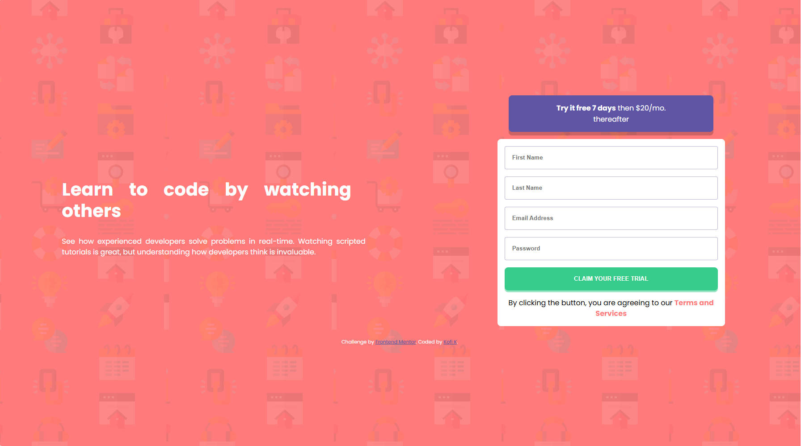
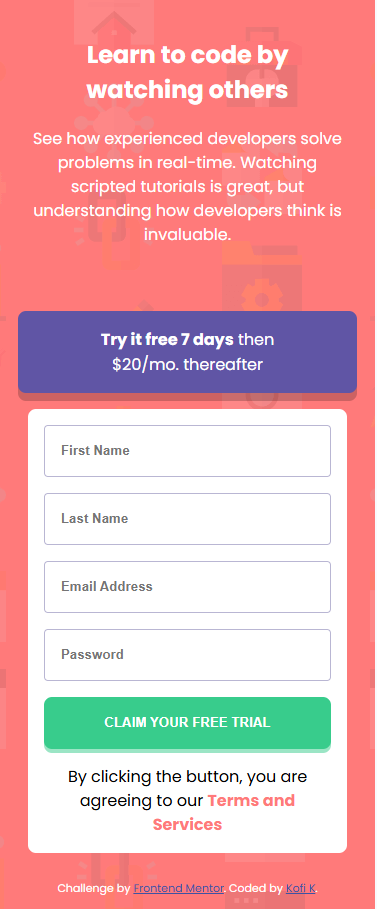
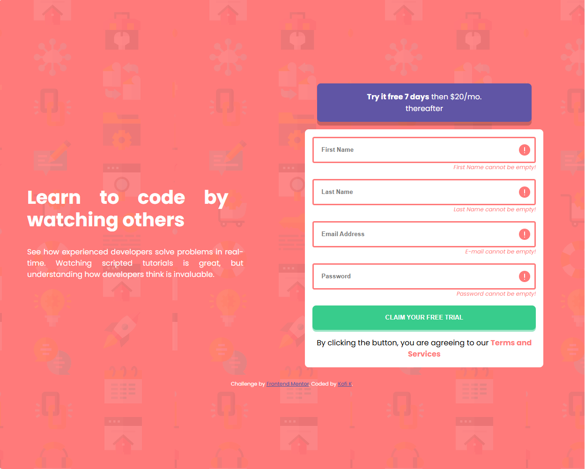
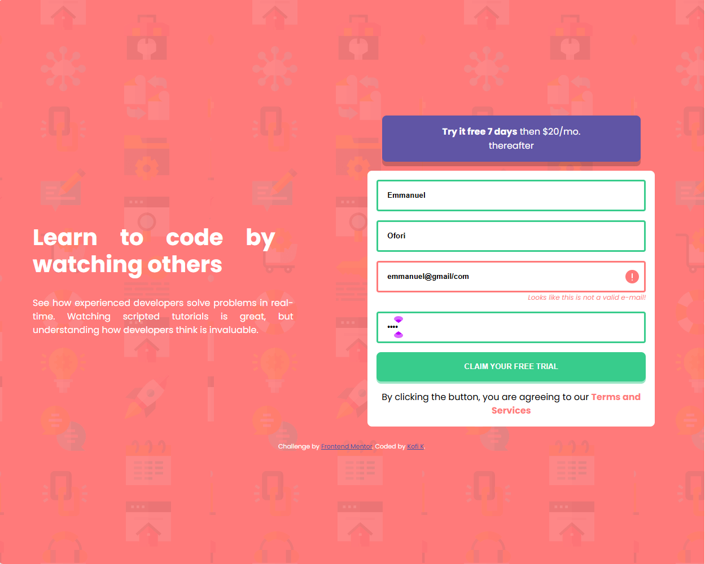
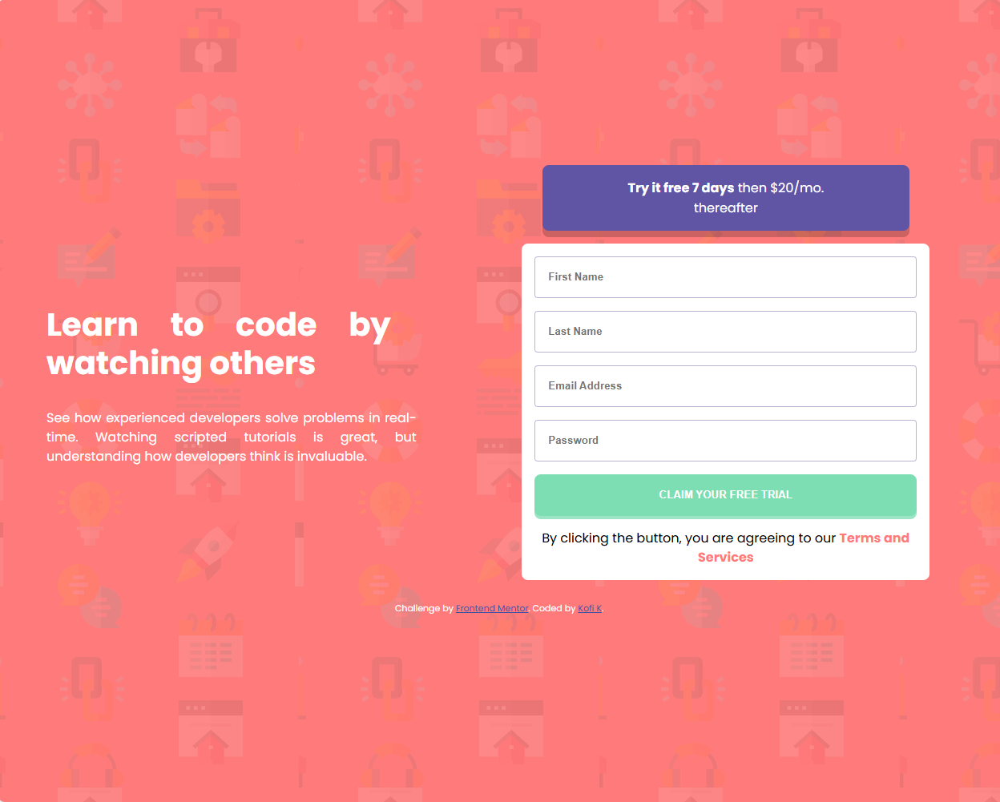

# An Introductory Component with a Sign Up Form using HTML,CSS, JavaScript

## Project Links

 

## Introduction
This is a Front-end Mentor project in which the objective was to make an Introductory Component webpage for a front-end developer website with the following objectives:

* To make the webpage responsive to any screen size.

* To implement active states to important elements on the webpage.

* To show an error message on any of the webpage's form's inputs if:
    1. it is either empty or null due to no input.

    2. for the e-mail input,to check if an inputted e-mail address is of the correct format/not.
    Correct format: example@host.tld

## Screenshots

Desktop View

Mobile View

Error State 1

Error State 2

Active State Submit Button

## Languages used
- HTML
- CSS
- JavaScript

# CONTACTS

